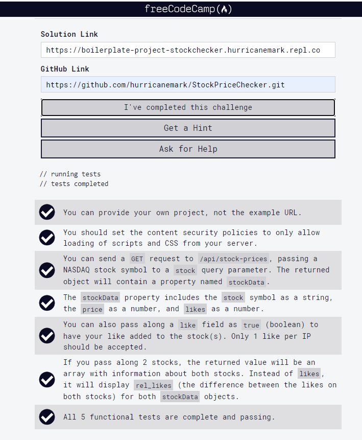

# Stock Price Checker

This is the boilerplate for the Stock Price Checker project. Instructions for building your project can be found at https://freecodecamp.org/learn/information-security/information-security-projects/stock-price-checker


## Test Results

```
 npm start

> boilerplate-project-stockchecker@0.0.1 start /home/runner/boilerplate-project-stockchecker
> node server.js

Your app is listening on port 3000
Running Tests...


  Functional Tests
    GET /api/stock-prices/
      ✓ 1 stock (706ms)
      ✓ 1 stock with like (303ms)
      ✓ 1 stock with like again (ensure likes arent double counted) (285ms)
      ✓ 2 stocks (636ms)


  4 passing (2s)
```


