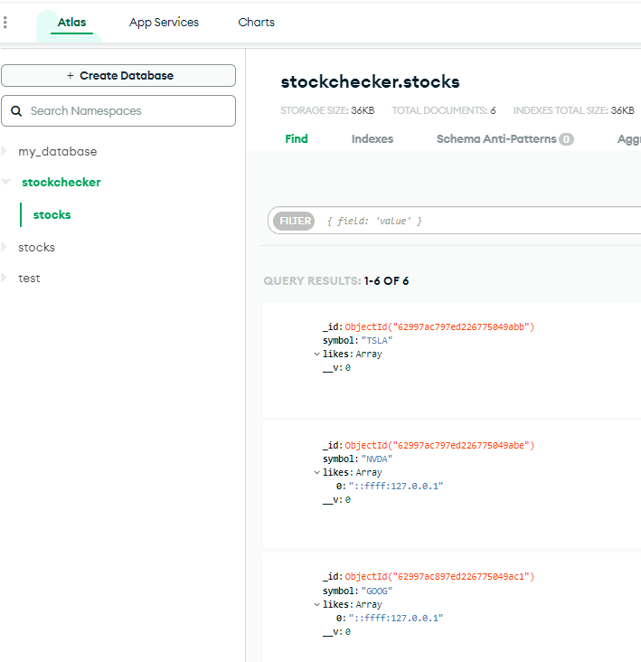

# Stock Price Checker

Instructions for building your project can be found at [Information Security Projects -- Stock Price Checker](https://freecodecamp.org/learn/information-security/information-security-projects/stock-price-checker)


This project has a standard layout initialized by command **npm init -y**
One should look at *package.json* for top down information.

Backend: The *server.js* drives the backend service logics in */routes/api.js*
The remaining code in */tests/* is dedicated to testing.

Frontend: The front-end code is in */views/index.html*  and */public/script.js*


## Upgrade nodejs to 15.14.0

This project requires nodejs 15 to resolve ES6 import issue.  Run the command below.

```
npm init -y && npm i --save-dev node@15 && npm config set prefix=$(pwd)/node_modules/node && export PATH=$(pwd)/node_modules/node/bin:$PATH
```

Declare identifier as follow to resolve ES6 error message '... import outside of module...'

```
const anonymize = (...args) => import('ip-anonymize').then(({default: anonymize}) => anonymize(...args));
const fetch = (...args) => import('node-fetch').then(({default: fetch}) => fetch(...args));
```


## Exercution

```
npm install

npm start

**or**

npm dev
```

## Test Results

```
 npm start

~/boilerplate-project-stockchecker$ npm run start

> boilerplate-project-stockchecker@0.0.1 start /home/runner/boilerplate-project-stockchecker
> node server.js

Your app is listening on port 1234
Running Tests...
MongoDB Connected 🍕


  Functional Tests
    GET /api/stock-prices/
https://stock-price-checker-proxy.freecodecamp.rocks/v1/stock/tsla/quote
Found Stock:  {
  _id: new ObjectId("629e6731622a2807b6e50ddf"),
  symbol: 'TSLA',
  likes: [],
  __v: 0
}
Stock Data:  TSLA 714.95
      ✓ 1 stock (528ms)
{ stock: 'TSLA', price: 714.95, likes: 0 }
https://stock-price-checker-proxy.freecodecamp.rocks/v1/stock/nvda/quote
Found Stock:  {
  _id: new ObjectId("629e6732622a2807b6e50de2"),
  symbol: 'NVDA',
  likes: [ '::ffff:127.0.0.1' ],
  __v: 0
}
Stock Data:  NVDA 187.81
      ✓ 1 stock with like (295ms)
https://stock-price-checker-proxy.freecodecamp.rocks/v1/stock/goog/quote
Found Stock:  {
  _id: new ObjectId("629e6733622a2807b6e50de5"),
  symbol: 'GOOG',
  likes: [ '::ffff:127.0.0.1' ],
  __v: 0
}
Stock Data:  GOOG 2338.64
      ✓ 1 stock with like again (ensure likes arent double counted) (331ms)
https://stock-price-checker-proxy.freecodecamp.rocks/v1/stock/tsla/quote
https://stock-price-checker-proxy.freecodecamp.rocks/v1/stock/nvda/quote
Found Stock:  {
  _id: new ObjectId("629e6733622a2807b6e50de8"),
  symbol: 'tsla',
  likes: [],
  __v: 0
}
Found Stock:  {
  _id: new ObjectId("629e6733622a2807b6e50deb"),
  symbol: 'nvda',
  likes: [],
  __v: 0
}
      ✓ 2 stocks (795ms)
https://stock-price-checker-proxy.freecodecamp.rocks/v1/stock/tsla/quote
https://stock-price-checker-proxy.freecodecamp.rocks/v1/stock/nvda/quote
Found Stock:  {
  _id: new ObjectId("629e6733622a2807b6e50de8"),
  symbol: 'tsla',
  likes: [],
  __v: 0
}
Found Stock:  {
  _id: new ObjectId("629e6733622a2807b6e50deb"),
  symbol: 'nvda',
  likes: [],
  __v: 0
}
      ✓ 2 stocks and liking them (498ms)


  5 passing (2s)

```

**FCC tests**


**MongoDB Data**



